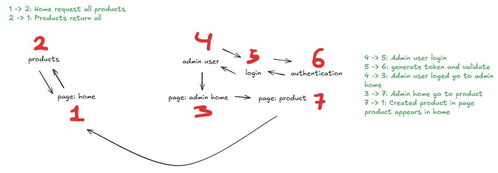

# HBL Ofertas

## Objetivo

Mostrar 50 ofertas da loja, onde o cliente pode acessar o site de vendas e ter acesso as redes sociais.
O admin terá acesso ao cadastro dos produtos, edição e exclusão deles em uma página separada.

## Tecnologias Utilizadas
  - Node.js
  - Fastify
  - Prisma
  - PostgreSQL (Neon Console)
  - Typescript

## Dependências Para Instalar
  - npm init
  - npm i -D typescript @types/node tsx tsup
  - npx tsc --init
  - npm i fastify
  - npm i @fastify/cors
  - npm i prisma -D
  - npm i @prisma/client
  - npx prisma init 
  - npm i decimal.js
  - npm i zod
  - npm i bcrypt

## Diagrama Das Rotas
  